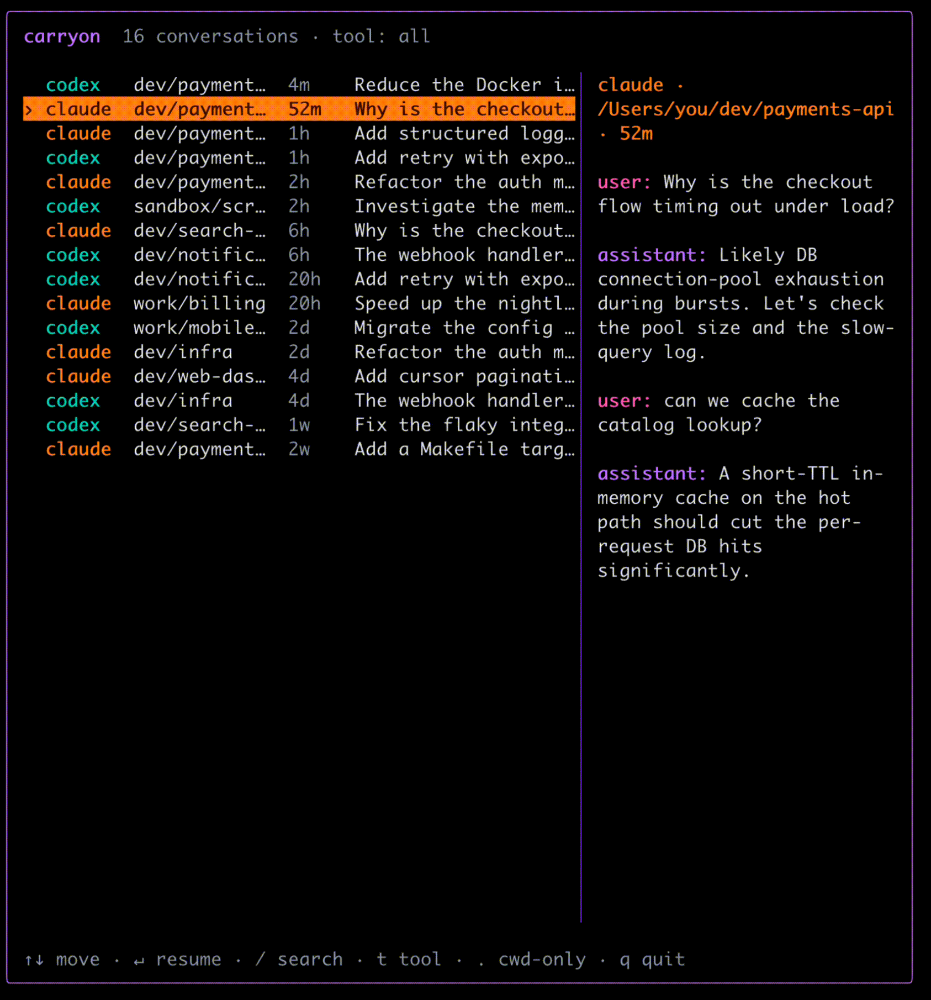

# carryon

One picker for **all** your Claude Code and Codex conversations — resume any of them from wherever you are in your terminal.

Both CLIs store their history centrally, but each one's built-in picker only shows sessions started in your current directory. `carryon` reads both stores, lists every conversation in an interactive TUI, and hands off to the native CLI to resume the one you pick — `cd`'d into its original project directory.



## Install

Requires **Go 1.26+** and the `claude` and/or `codex` CLI already installed. macOS and Linux only.

```sh
go install github.com/mohammedamarnah/carryon@latest
```

This puts `carryon` on your `PATH` (in `$(go env GOBIN)`, or `$(go env GOPATH)/bin`) — make sure that directory is on your `PATH`.

From source:

```sh
git clone https://github.com/mohammedamarnah/carryon && cd carryon
go build -o carryon .
```

## Usage

Run it from anywhere:

```sh
carryon
```

| Key | Action |
| --- | --- |
| `↑`/`↓` or `k`/`j` | Move |
| `/` then type | Fuzzy search (project, title, tool) |
| `t` | Cycle tool filter: all → claude → codex |
| `.` | Toggle "current directory only" |
| `↵` | Resume the highlighted conversation |
| `q` / `esc` / `ctrl-c` | Quit |

Selecting a conversation replaces `carryon` with a live `claude --resume <id>` or `codex resume <id>` session in the conversation's original project directory.

## How it works

- **Discovery** reads `~/.claude/projects/*/*.jsonl` and `~/.codex/sessions/**/rollout-*.jsonl`, parsing each session's working directory, git branch, first message, and timestamp. No filesystem-wide crawl.
- **Resume** runs through your login shell (`$SHELL -ic`) so your usual aliases and flags apply — e.g. if `claude` is aliased to `claude --dangerously-skip-permissions`, the resumed session inherits it.
- The session id is passed as a positional shell argument and validated as a UUID, so it can never be interpreted as shell code.
